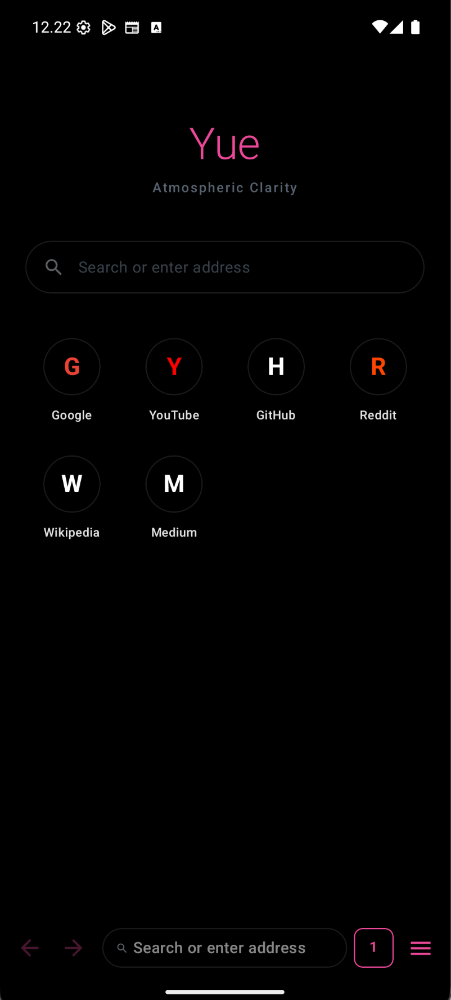
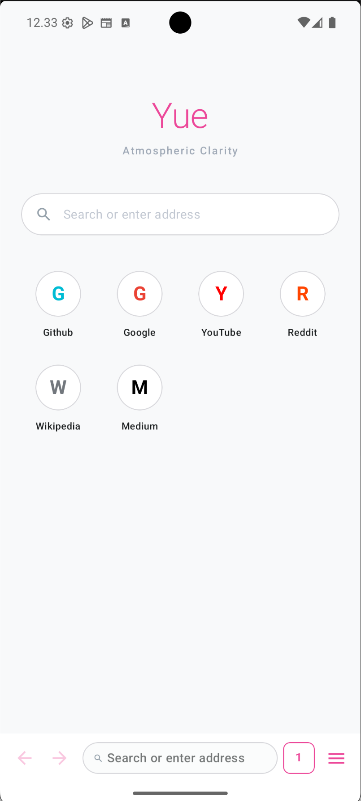
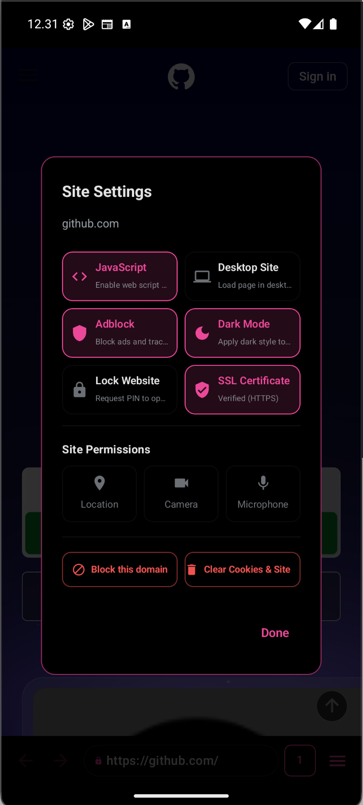
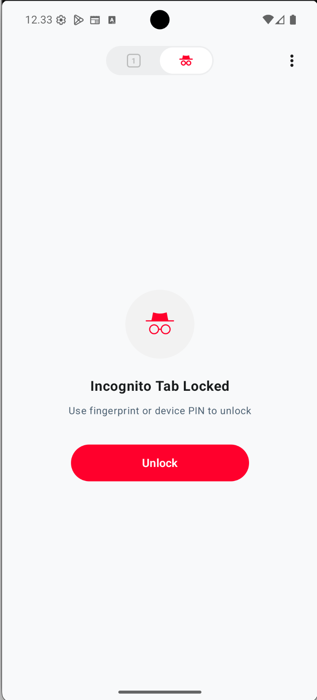
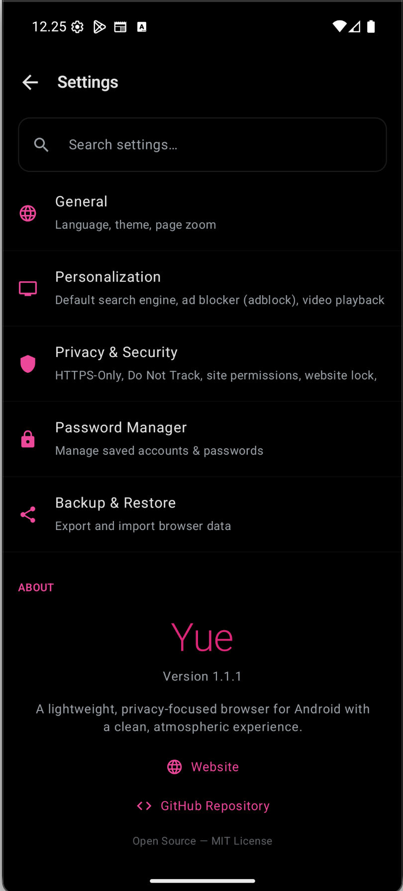
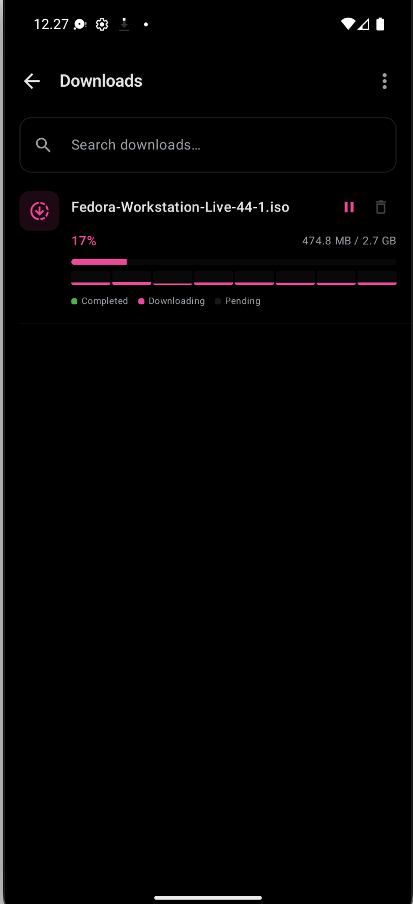

# Yue Browser

> A premium, high-performance Android web browser built with Jetpack Compose and the Android System WebView engine. Privacy-first, feature-rich, and visually elegant.

---

## Screenshots

| Homepage (Dark) | Homepage (Light) |
| :---: | :---: |
|  |  |

| Site Settings | Lock Private Tab |
| :---: | :---: |
|  |  |

| Settings Page | Download Manager |
| :---: | :---: |
|  |  |

---

## Features

- **Anti-Tracking & Security** — Block trackers and third-party cookies, mask browser fingerprints, enforce HTTPS-Only mode, enable Safe Browsing, and view detailed SSL certificates.
- **Background Media Playback** — Play video and audio in the background, even with the device locked, in both normal and private tabs.
- **Hold to Speedup** — Press and hold anywhere on a playing video to instantly speed it up to 2x.
- **Website & Incognito Lock** — Guard private tabs with Biometrics or Device PIN, and lock specific domains behind a custom PIN.
- **Multi-Thread Downloader** — Split downloads into parallel byte-range chunks for faster transfer rates.
- **Anti Open-in-App** — Prevent sites from hijacking navigation to force-launch third-party native apps.
- **Encrypted Backups** — Back up settings, bookmarks, and passwords with AES-256-GCM using PBKDF2-derived keys.

---

## Documentation

Detailed feature guides:

- [Privacy & Security](docs/privacy_security.md)
- [Adblock & Element Picker](docs/adblock.md)
- [Download Manager](docs/download_manager.md)
- [Media & Playback Controls](docs/playback.md)
- [Backup & Restore](docs/backup_restore.md)

---

## Tech Stack

- **Framework**: Kotlin + Jetpack Compose
- **Design**: Material Design 3 (M3)
- **Engine**: Android System WebView
