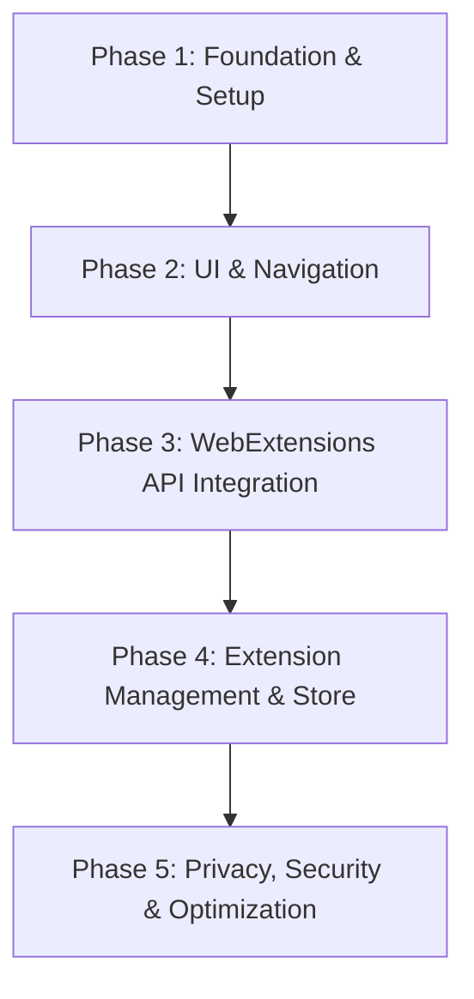

# Yue Browser: Gecko-Based Browser with Full Extension Integration

Yue Browser is a modern, high-performance web browser built on top of the Mozilla Gecko engine (GeckoView/Gecko), featuring comprehensive support for WebExtensions (Manifest V2 and V3).

## 📌 Project Overview

This project aims to develop a custom browser that prioritizes user control, privacy, and full compatibility with browser extensions, bringing desktop-class extension capabilities to a lightweight, customizable browser.

---

## 🛠️ Technology Stack

- **Browser Engine:** Mozilla Gecko / GeckoView (for Android) or custom LibXUL embedding.
- **Frontend / UI:** 
  - **Android:** Kotlin & Jetpack Compose
  - **Desktop (Alternative):** Rust / C++ wrapping Gecko engine, styled with Vanilla CSS/JS.
- **Extension Engine:** Mozilla WebExtensions API implementation.

---

## 🚀 Development Roadmap & Phases

### Phase 1: Foundation & Setup (Engine Integration)
- [x] Initialize the project repository and set up build pipelines (Gradle/Cmake).
- [x] Integrate GeckoView / Gecko engine dependencies.
- [x] Create a basic web view component that renders a simple HTML page.
- [x] Establish logging, crash reporting, and debug telemetry.

### Phase 2: Core Browser Features & UI
- [x] Design and implement the URL address bar and navigation controls (back, forward, refresh).
- [x] Implement multi-tab management (opening, closing, switching tabs).
- [x] Add basic browsing features: History, Bookmarks, and Downloads (Basic Quick Access implemented).
- [x] Apply modern, premium styling (dark mode, smooth animations, dynamic color palettes).

### Phase 3: WebExtensions API Integration
- [ ] Set up the WebExtensions framework within the Gecko environment.
- [ ] Implement core APIs:
  - `webRequest` (for ad-blockers and privacy extensions).
  - `tabs` and `runtime` (for extension lifecycle and inter-process communication).
  - `storage` (local and sync extension data storage).
- [ ] Enable support for Content Scripts injection and Background Pages/Service Workers.

### Phase 4: Extension Management UI
- [ ] Build an "Extensions" dashboard to enable, disable, and configure installed add-ons.
- [ ] Support manual installation of extensions via `.xpi` or `.zip` files.
- [ ] Integrate with a custom add-on repository or allow importing directly from AMO (addons.mozilla.org).
- [ ] Set up permission prompts for extensions (fine-grained control).

### Phase 5: Privacy, Security & Polish
- [ ] Implement sandboxing for extensions to prevent unauthorized device access.
- [ ] Optimize memory usage and startup time.
- [ ] Conduct performance benchmarking for rendering and extension overhead.
- [ ] Release Alpha/Beta builds for community testing.

---

## 🔑 Key Challenges & Solutions

| Challenge | Solution |
| :--- | :--- |
| **Manifest V3 Compatibility** | Implement bridge mapping for Manifest V3 declarativeNetRequest to Gecko's equivalent APIs. |
| **Performance Overhead** | Run extension background pages in isolated, low-priority threads/processes. |
| **Security Risks** | Enforce strict Content Security Policy (CSP) and permission validation before installation. |

---

## 📖 How to Get Started

1. Open this repository `/Users/fazza_abiyyu/Documents/Projects/Hobby/Atomic` in **Android Studio**.
2. Android Studio will sync the project and download all Gradle dependencies (including GeckoView from the Mozilla Maven repository).
3. Connect an Android device or launch an emulator (API Level 26+).
4. Run the project to test the basic GeckoView implementation.
