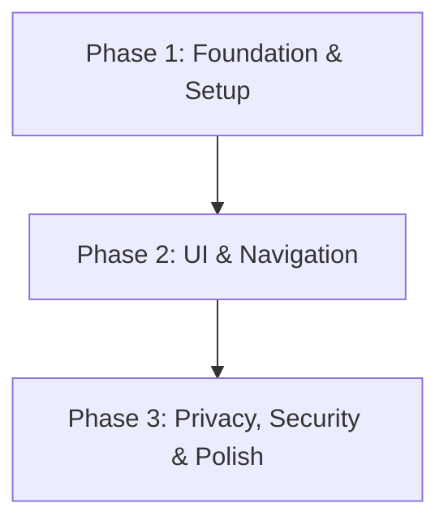

# Yue Browser: Android WebView-Based Browser

Yue Browser is a modern, high-performance web browser built on top of the Android WebView engine.

## 📌 Project Overview

This project aims to develop a custom browser that prioritizes user control and privacy, bringing desktop-class browsing capabilities to a lightweight, customizable browser.

---

## 🛠️ Technology Stack

- **Browser Engine:** Android WebView (android.webkit.WebView)
- **Frontend / UI:** 
  - **Android:** Kotlin & Jetpack Compose

---

## 🚀 Development Roadmap & Phases

### Phase 1: Foundation & Setup (Engine Integration)
- [x] Initialize the project repository and set up build pipelines (Gradle/Cmake).
- [x] Set up Android WebView dependencies.
- [x] Create a basic web view component that renders a simple HTML page.
- [x] Establish logging, crash reporting, and debug telemetry.

### Phase 2: UI & Navigation
- [x] Design and implement the URL address bar and navigation controls (back, forward, refresh).
- [x] Implement multi-tab management (opening, closing, switching tabs).
- [x] Add basic browsing features: History, Bookmarks, and Downloads (Basic Quick Access implemented).
- [x] Apply modern, premium styling (dark mode, smooth animations, dynamic color palettes).
- [x] Implement forward history support and optimized navigation state management.
- [x] Add background playback support for media content.

### Phase 3: Privacy, Security & Polish
- [ ] Optimize memory usage and startup time.
- [ ] Conduct performance benchmarking for rendering.
- [ ] Release Alpha/Beta builds for community testing.

---

## 🔑 Key Challenges & Solutions

| Challenge | Solution |
| :--- | :--- |
| **Performance Overhead** | Implement lazy rendering of only active or media-playing browser tabs to reduce resource consumption. |
| **Memory Management** | Optimize memory usage and startup time through efficient resource allocation. |

---

## 📖 How to Get Started

1. Open this repository `/Users/fazza_abiyyu/Documents/Projects/Hobby/Atomic` in **Android Studio**.
2. Android Studio will sync the project and download all Gradle dependencies.
3. Connect an Android device or launch an emulator (API Level 26+).
4. Run the project to test the basic WebView implementation.

## ✨ Recent Features

### Performance Optimizations
- **Memory & CPU Optimization**: Lazily render only active or media-playing browser tabs to reduce resource consumption
- **Background Playback**: Support for media playback when browser tabs are in background

### UI Improvements
- **Forward History**: Added forward navigation support
- **BrowserBottomBar Redesign**: Improved spacing and alignment for better user experience
- **Premium Styling**: Dark mode, smooth animations, and dynamic color palettes

### Core Browser Features
- **Multi-tab Management**: Open, close, and switch between tabs
- **Navigation Controls**: URL address bar with back, forward, and refresh buttons
- **Basic Browsing Features**: History, Bookmarks, and Downloads (Quick Access implemented)
